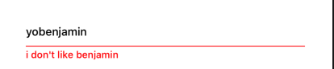
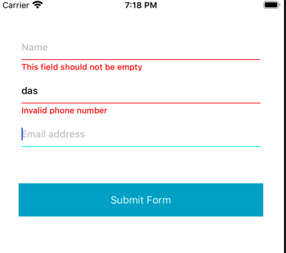

# Generic Form 

Generic Form : a generic implementation of a form 

## Validator 

Validators is an enum with severals utils functions that you can use :
- required 
- regular expression
- email
- password

Example of usage : 
```swift
nameField.validators = [.required]
emailField.validators = [.required, .email]
```

## Play with validators

You should take a look at the unit tests to understand what is the behaviour of a TextField depending to a validator. 
Here there is a MockTextField  that have two variables : "isValid" and "messages" that are computed properties. 
It will call the validator associated functions. 
In this example : "BobyLeMec" is not an email and should trigger a error message and "BobyLeMec@gmail.com" on the other hand is valid. 

```swift
func testExample() {
       let mockTextField = MockTextField()
       mockTextField.validators = [.email]

       mockTextField._text = "BobyLeMEc"

       XCTAssert(mockTextField.isValid == false)
       XCTAssert( mockTextField.messages.count == 1)
       XCTAssert( mockTextField.messages[0] == "Invalid email format")
       
       mockTextField.text = "BobyLeMEc@gmail.com"

       XCTAssert(mockTextField.isValid == true)
       XCTAssert( mockTextField.messages.count == 0)
}
```

## Override the localizable strings for the generic validators 

You can override the localizable strings that are used by the generic validators (.required, .email ...)

```swift
"field_empty_error" = "This field should not be empty";
"email_format_invalid_error" = "Invalid email format";
"mobile_number_invalid" = "Invalid phone number";
"specials_characters" = "Use at least one special character and no spaces";
"password_has_wrong_length" = "Password must be 8–20 characters";
"password_number_letter_suggestion" = "Use at least one number and one letter";
```

## Write your own validation logic 



You can write your own validation logic by using the .custom value in the Validator enum.
It allows you to write a closure that is going to be use inside the validation logic. 
It should return a tuple (Bool, [String]) where the bool argument say if the field is valid and thee second return the errors messages. 
In this example : It will detect that the textField contains "benjamin" and trigger and error message if so. 

```swift

nameField.validators = [.custom({ textField in
    let isValid = !(textField._text ?? "").contains("benjamin")
    return (isValid, isValid ? [] : ["i don't like benjamin"])
})
]

```

## Example of usage in a ViewController 



```swift

class ViewController : UIViewCoordinable {
    
    // The IBOutlet from the xib 
    @IBOutlet weak var nameField: FormTextField!
    @IBOutlet weak var phoneNumberField: FormTextField!
    @IBOutlet weak var emailField: FormTextField!
    
    var fields: [FormTextField] = []
    
    override func viewDidLoad() {
        super.viewDidLoad()
        
        // Store all the FormTextField to handle the form state
        fields = [nameField, phoneNumberField, emailField]
        
        // Write your validators logic here
        nameField.validators = [.required]
        emailField.validators = [.required, .email]
        phoneNumberField.validators = [.required, .mobileNumber]
        
        buildUI()
    }
    
    func buildUI() {
        nameField.placeholder = "Name"
        nameField.textField.autocorrectionType = .no
        nameField.textField.autocapitalizationType = .none
        nameField.textField.accessibilityIdentifier = "emailField"
        
        emailField.placeholder = "Email address"
        emailField.keyboardType = .emailAddress
        emailField.textField.autocapitalizationType = UITextAutocapitalizationType.none
        emailField.textField.accessibilityIdentifier = "emailField"
        
        phoneNumberField.placeholder = "Phone Number"
        phoneNumberField.keyboardType = .phonePad
        phoneNumberField.textField.autocapitalizationType = UITextAutocapitalizationType.none
        phoneNumberField.textField.accessibilityIdentifier = "phoneNumber"
    }
    
    // Bind the validation logic 
    @IBAction func submitAction(_ sender: Any) {
        for field in fields {
            field.performValidation()
        }
    }
}

```

